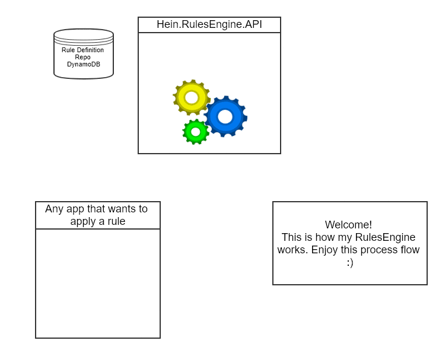

# Hein.RulesEngine-v3
Dynamic Rules Engine that applies defined logic to payload
<p align="center">

</p>

## What makes it special
### Rule Creation/Updates
Admin's (use an admin too) create rules using some basic IF/ELSE IF/ELSE conditions in a `Visual Basic` fashion.
```visualbasic
IF [EventId] = 8000
   [IsStatus] = true
ELSE
   [IsStatus] = false
ENDIF
```
Rules Engine converts this Visual Basic code to appliable javascript code (what I call engine code):
```javascript
if (values["EventId"] == 8000) {
   values["IsStatus"] = true;
}
else {
   values["IsStatus"] = false;
}
```
And saves both Admin and Engine to the rule definition stored in a datastore.  

### Rule Execution
When applications want to apply rules... it should generate the payload, with a ruleset name for RulesEngine to get the correct rule definition.  
* 'rule' = rule definition for rules engine to apply  
* 'values' = parameters for rules engine to apply logic too  
```json
{
   "rule": "is_event_id_a_status",
   "values": {
      "EventId": 9580
   }
}
```
That application will post to the `~/Execute` endpoint for rules engine to apply the rule logic against the payload  
And in return, based on the logic inside the rule, will return the same payload with updated values/parameters
```json
{
   "rule": "is_event_id_a_status",
   "values": {
      "EventId": 9580,
      "IsStatus": false
   }
}
```
